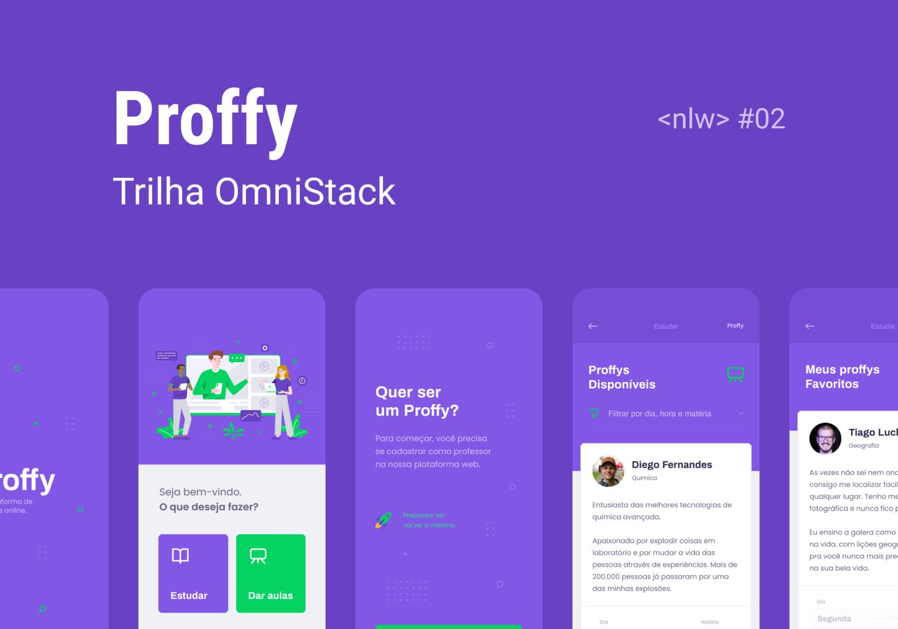

# Proffy

<p align="center">
  
</p>

<h4 align="center">
  Platform to connect teachers (proffys) and students
</h4>

<p align="center">
  <a href="#rocket-technologies">Technologies</a>&nbsp;&nbsp;&nbsp;|&nbsp;&nbsp;&nbsp;
  <a href="#information_source-how-to-use">How To Use</a>&nbsp;&nbsp;&nbsp;|&nbsp;&nbsp;&nbsp;
</p>

<p align='center'>
  <a href="https://insomnia.rest/run/?label=Proffy&uri=https%3A%2F%2Fraw.githubusercontent.com%2Fmesquini%2Fproffy%2Fmaster%2FProffy.json" target="_blank"></a>
</p>

## :rocket: Technologies

This project was developed to studying JSON and React with the following technologies:

- [ReactJS](https://reactjs.org/)
- [Axios](https://github.com/axios/axios)
- [VS Code][vc]

## :information_source: How To Use

```bash
# Clone this repository
$ git clone https://github.com/mesquini/proffy

> cd proffy

> cd server
> yarn install
> yarn dev

> cd web
> yarn install
> yarn start

> cd mobile
> yarn install
> yarn start
```

---

Made with ♥ by Victor Mesquini :wave: [Get in touch!](https://www.linkedin.com/in/mesquini/)

[nodejs]: https://nodejs.org/
[yarn]: https://yarnpkg.com/
[vc]: https://code.visualstudio.com/
